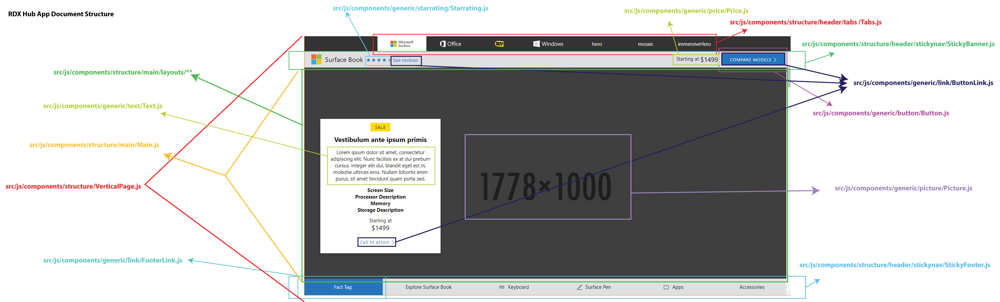

# RDX Prototype
This is the React prototype of RDX. The master branch is built and then imported into the RDX hub app, which is located elsewhere.
Contact cmcguire@microsoft.com for more information.
The original Surface Book prototype is located in a branch called modular-merge-sb.
## Usage
###Installation and running the demo app.
```
npm install
npm start
```
Go to localhost://9080 to see the Hub App in dev mode.

###Component Library
Run React Storybook to test individual Components. This is intended to provide a rough overview of what components are in use,
components should still be tested in the full app after any updates are made.
```
npm run storybook
```

###Testing
This project uses Enzyme and Jest for JS unit testing.
```
npm run test
```

##Building
Note: The build folder will only run in the RDX app (but you can test it in chrome).
Build unminified dev version with images
```
npm run build-dev
```

Build Production version (minified without images)
```
npm run build-prod
```

##Document Structure
The app is laid out as follows:
```
src/
├── data/
    ├── legacy/ -- Data for legacy layouts
    ├── new/    -- Data for new MWF layouts
    ├── partner/    -- Data for partner specific layouts like HP
    ├── assembleData.js -- This is where we pipe in dummy data
    ├── dataProps.js    -- Sets required props for warnings in dev mode, deprecated.
├── js/
│   └── app.js  -- Main entry point
│   └── components/
│       └── structure/
│           │    └── header/
│           │        ├── Down Arrow
│           │        ├── Sticky Nav
│           │        └── Tabs
│           ├── MasterLayout.js
│           └── VerticalPage.js
│               └── main/
│                   ├── Main.js
│                   └── vertical/
│                   │   └── Vertical.js
│                   └── layouts
│                       ├── Compare Chart
│                       ├── Hero
│                       ├── Legacy
│                       └── Mosaic
```



